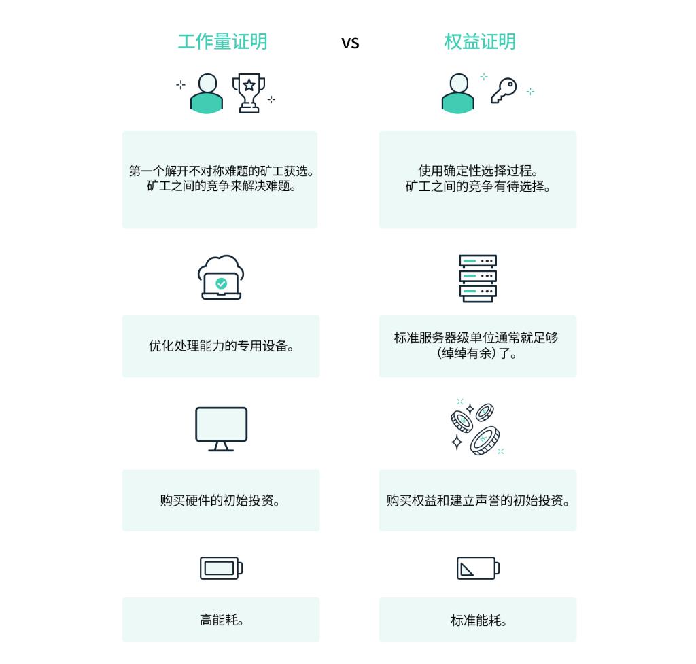

<a name="RVZG7"></a>

## 介绍

工作量证明 - Proof of Work 是一种对应服务与资源滥用、或是拒绝服务攻击的经济对策。一般要求用户进行一些耗时适当的复杂运算，并且答案能被服务方快速演算，以此耗用的时间、设备与能源作为担保成本，以确保服务与资源是被真正的需求所使用 <a name="nsBuN"></a>

## 与持有量证明 Pos 的对比

持有量证明 - Proof of Stake，又名权益证明
 <a name="gA9q6"></a>

## Proof of Work 与 Bot 防护

在 JavaScript 中，实现 Proof of Work 通常用于防止恶意 bot 的攻击，特别是在需要用户执行一些任务或工作以验证其身份的场景中。 <a name="vueCD"></a>

### 原理

基于引入一些计算密集型任务，要求客户端（正常用户）在请求资源时必须完成这些任务，而这些任务对于 bot 来说通常是非常耗时的，从而有效驱人正常用户 or 恶意 bot <a name="tlSm7"></a>

### 步骤

1. 分配计算任务：在用户试图进行某些敏感操作之前，分配一个计算任务（最好是服务端生成），要求用户进行 Proof of Work，这可能涉及到计算一个 hash 或执行一些复杂的数学计算，这些任务会消耗大量的计算资源同时耗费大量时间
2. 任务要求：当用户发起请求时，服务器要求用户在请求中执行该任务。可以通过向用户提供需要计算的数据，要求用户执行复杂操作，或者要求用户解决一个难题来实现
3. 随机化任务：确保计算任务是随机的，这样攻击者不能预测任务，也不能提前计算并存储答案
4. 限频：限制用户完成计算任务的频率，以防止机器人尝试大规模攻击，可以通过设置一个时间间隔或者其他限频措施来实现
5. 调整难度：根据需要调整计算任务的难度，如果发现机器人攻击频繁，可以增加计算任务的难度，使其更加难以完成
6. 验证：一旦收到用户的请求和计算结果，服务器会验证用户执行任务的正确性。如果任务被正确地完成，服务器将响应用户的请求。否则服务器会拒绝服务或要求用户重新执行任务
7. 监控异常行为：实时监控系统，定期检查用户的行为模式，如果发现异常的高频率活动，可能是机器人攻击的迹象
8. 成本增加：对于恶意 bot 而言，其资源时有限的，由于计算密集型任务需要耗费大量的资源和时间，所以会增加恶意 bot 发起攻击的成本，从而减少了其攻击效率和可行性

> 注意：PoW 不是绝对安全的，因为攻击者可能利用分布式计算等技术来加速计算过程，因此它通常被视为一种附加的安全层，而不是唯一的防御手段，在实际应用中，可以考虑与其他身份验证和安全措施结合使用，以提高整体的安全性

<a name="R5M8E"></a>

### 目的

使恶意 bot 难以大规模地自动化发起攻击，因为它们无法有效地完成服务器端要求的计算机密集型任务，而这些任务对于正常用户来说只是一种很小的负担，因此服务器能够有效地区分出正常用户 or 恶意 bot，并提供更好的服务保护 <a name="PvPlS"></a>

### 案例 1 - 纯前端

```html
<!DOCTYPE html>
<html>
  <head>
    <title>Proof of Work Example</title>
    <script src="https://cdnjs.cloudflare.com/ajax/libs/crypto-js/4.0.0/crypto-js.min.js"></script>
  </head>
  <body>

    <div id="puzzle"></div>
    <input type="text" id="solution" placeholder="Enter the solution">
    <button onclick="verifySolution()">Verify</button>

    <script>
      // 生成哈希值的前导 0 的个数
      const difficulty = 4

      // 生成一个包含指定数量前导 0 的字符串
      const genHashPrefix = difficulty => Array(difficulty + 1).join('0')

      // 生成谜题
      const generatePuzzle = () => {
        const randomString = Math.random().toString(36).substring(2, 15) + Math.random().toString(36).substring(2, 15)
        const hashPrefix = genHashPrefix(difficulty)
        let solution = ''
        let nonce = 0
        
        // 寻找符合要求的哈希值
        while (!solution.startsWith(hashPrefix)) {
          nonce++;
          solution = CryptoJS.SHA256(randomString + nonce).toString()
        }

        return { randomString, nonce, solution }
      }

      // 验证用户解决方案
      const verifySolution = () => {
        const userSolution = document.getElementById('solution').value
        const { randomString, nonce } = puzzle
        const hashPrefix = genHashPrefix(difficulty)
        const solutionAttempt = CryptoJS.SHA256(randomString + nonce + userSolution).toString()

        if (solutionAttempt.startsWith(hashPrefix)) {
          alert('Proof of Work verified, you are human!')
        } else {
          alert('Proof of Work verification failed, please try again.')
        }
      };

      // 生成谜题并展示在页面上
      const puzzle = generatePuzzle()
      document.getElementById('puzzle').innerText = `Find a string that, when concatenated with ${puzzle.randomString} and ${puzzle.nonce}, produces a hash starting with ${generateHashPrefix(difficulty)}`
    </script>
  </body>
</html>

```

<a name="eDCuk"></a>

### 案例 2 - 前后端

- 前端

```jsx
import React, { useState, useEffect } from 'react'
import axios from 'axios'

function App () {
  const [puzzle, setPuzzle] = useState('')
  const [solution, setSolution] = useState('')
  const [verificationResult, setVerificationResult] = useState('')

  const fetchPuzzle = async () => {
    const res = await axios.get('/puzzle')
    setPuzzle(res.data.puzzle)
  }

  const verifySolution = async () => {
    const res = await axios.post('verify', { solution })
    setVerificationResult(res.data.message)
  }

  useEffect(() => {
    fetchPuzzle()
  }, [])

  return (
    <div>
      <div>
        <p>{puzzle}</p>
        <input type="text" value={solution} onChange={e => setSolution(e.target.value)} />
        <button onClick={verifySolution}>Verify</button>
      </div>
      {verificationResult && <p>{verificationResult}</p>}
    </div>
  )
}

export default App
```

- 后端

```javascript
const Koa = require('koa')
const Router = require('@koa/router')
const CryptoJS = require('crypto-js')

const app = new App()
const router = new Router()

// 计算哈希值的前导 0 的个数
const difficulty = 4

// 生成一个包含指定数量前导 0 的字符串
const genHashPrefix = difficulty => Array(difficulty + 1).join('0')

router.get('/puzzle', ctx => {
  const randomString = Math.random().toString(36).substring(2, 15) + Math.random().toString(36).substring(2, 15)
  // 生成哈希前缀
  const hashPrefix = genHashPrefix(difficulty)
  let solution = ''
  let nonce = 0
	
  // 持续计算哈希，直到满足难度要求 solution.substring(0, difficulty) !== hashPrefix
  while (!solution.startsWith(hashPrefix)) {
    nonce++
    solution = CryptoJS.SHA256(randomString + nonce).toString()
  }

  ctx.body = {
    puzzle: `Find a string that, when concatenated with ${randomString} and ${nonce}, produces a hash starting with ${generateHashPrefix(difficulty)}`
  }
})

router.post('/verify', ctx => {
  const { solution } = ctx.request.body
  const { randomString, nonce } = ctx.request.body
  const hashPrefix = genHashPrefix(difficulty)
  const solutionAttempt = CryptoJS.SHA256(randomString + nonce + solution).toString()

  if (solutionAttempt.startsWith(hashPrefix)) {
    ctx.body = {
      message: 'Proof of Work verified, you are human!'
    }
  } else {
    ctx.body = {
      message: 'Proof of Work verification failed, please try again.'
    }
  }
})

app.use(require('koa-body')())
app.use(router.routes()).use(router.allowedMethods())

app.listen(3000, () => {
  console.log('Server is running on port 3000')
})
```

<a name="UP4x7"></a>

## Proof of Work 普通用户快速验证

- 前端

```tsx
import React, { useCallback, useState } from "react";
import axios from "axios";

export default function App() {
  const [result, setResult] = useState("");
  const [userInput, setUserInput] = useState('')
  const [loading, setLoading] = useState(false);
  // Generate a simple math problem for the user to solve
  const num1 = Math.floor(Math.random() * 10);
  const num2 = Math.floor(Math.random() * 10);
  const answer = num1 + num2;

  const performProofOfWork = useCallback(async () => {
      setLoading(true);
  
      // Display the math problem to the user
      setResult(`${num1} + ${num2} = ?`);
  
      // Ask the server to verify the user's solution
      // const userInput = prompt(`What is the sum of ${num1} and ${num2}?`);
  
      // @ts-ignore
      if (parseInt(userInput, 10) === answer) {
        // Send a request to the server for further verification
        try {
          const response = await axios.post("/api/verify", {
            userInput,
          });
          alert(response.data.message); // Display the server response
        } catch (error) {
          console.error("Error verifying Proof of Work:", error);
        }
      } else {
        alert("Incorrect answer. Please try again.");
        setUserInput('')
      }
  
      setLoading(false);
  }, [userInput])

  return (
    <div className="p-10 h-screen space-y-4">
      <input value={userInput} onInput={e => setUserInput((e.target as any).value)} placeholder={`What is the sum of ${num1} and ${num2}?`} disabled={loading} type="text" className="block w-30 relative outline-none border border-gray-400 rounded py-1 px-2 w-full bg-white text-sm text-gray-700 placeholder-gray-400 focus:outline-none focus:shadow-outline" />
      <button onClick={performProofOfWork} className="pointer-events-auto rounded-md bg-indigo-600 px-3 py-2 text-[0.8125rem] font-semibold leading-5 text-white hover:bg-indigo-500">
        {loading ? "Verifying..." : "Perform Proof of Work"}
      </button>
      <p>{result}</p>
    </div>
  );
}
```

- 后端

```javascript
const Koa = require('koa')
const bodyParser = require('koa-bodyparser')
const Router = require('@koa/router')

const app = new Koa()
const router = new Router()

const performPoWVerification = (userInput) => {
  // Replace this with your actual PoW verification logic
  // For simplicity, just compare the userInput with a predefined answer
  const answer = 5; // Change this to the correct answer
  return userInput > answer;
}

router.get("/", (ctx) => {
  ctx.body = "home"
});

router.post("/verify", (ctx) => {
  const userInput = parseInt(ctx.request.body.userInput, 10)

  // Replace this with your actual PoW verification logic
  const isProofOfWorkValid = performPoWVerification(userInput)

  if (isProofOfWorkValid) {
    ctx.body = { message: "Proof of Work verified successfully!" }
  } else {
    ctx.status = 403; // Forbidden
    ctx.body = { message: "Proof of Work verification failed." }
  }
});

app.use(bodyParser())
app.use(router.routes()).use(router.allowedMethods())

app.listen(3001, () => {
  console.log(`Server listening on port ${3001}`)
});
```
