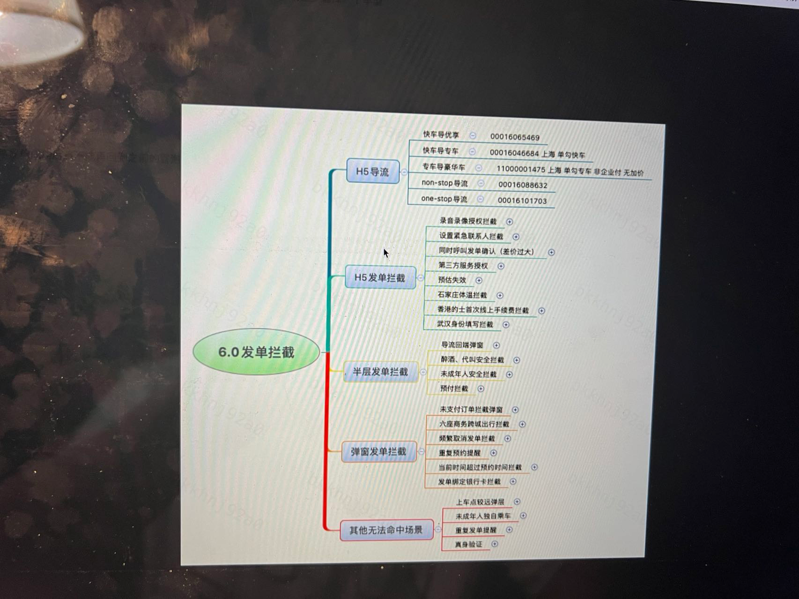

### 冒泡页功能梳理

- 地图区域
  - 修改起点
  - 修改终点
  - 多路线切换
  - 归位
  - 最佳视图
  - 安全盾
- 表单区域
  - 沟通组件
    - 车型上方
    - 车型下方
  - 车型列表
    - 推荐置顶车型(带皮肤)
      - 优惠置顶
      - D1 置顶
      - 盒子置顶
    - 导流车型
      - 特价拼车
      - 远途特价
    - 拼车
      - 拼车 v2
      - 拼车 v3
    - 盒子
      - 出租车盒子
      - 第三方盒子
      - 打包盒子
    - 套餐车型
    - 标签导流车型
    - 气泡导流车型
    - 附加费用说明
    - etp
    - 更多车型引导气泡
  - 组件区域
    - 时间组件
    - 代叫组件
    - 支付组件
      - 现金支付
      - 企业支付
      - 个人支付
      - 电子支付(香港的士)
  - 发单
    - 正常发单
    - 发单接口
    - 发单拦截 

### 预估接口请求时机

- 选择起终点进入冒泡页
- 地图上修改起终点成功
- 切换多路线
- 预估失败重新刷新
- 操作区改变
  - 时间组件
  - 代叫组件
  - 支付方式
- 拼车选座
- 豪华车更换车型
- 前后台切换
- 命中动调时取消勾选溢价保护
- 发单拦截(1124：当前时间超过预约时间拦截) 

### 发单拦截

1、从冒泡页接口中会有一个特定字段返回拦截信息，这块的信息我们是提前存储好的，用户点击发单时校验这一块的内容，看是否需要拦截，一般是提前告知终点不好停车，起终点距离过近等预估阶段能拿到的信息
2、点击发单后，发单接口的服务端会校验订单类型，起终点等，通过这些信息，判断是否需要拦截。录音录像授权、三方服务协议确认、以及是否有顺路拼车，用户账号是否命中一些营销方案（推荐发拼车、专车、优享等订单，这个我们叫导流）
大的部分主要就是这两块

